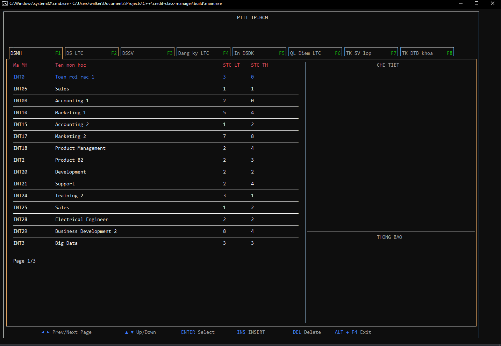
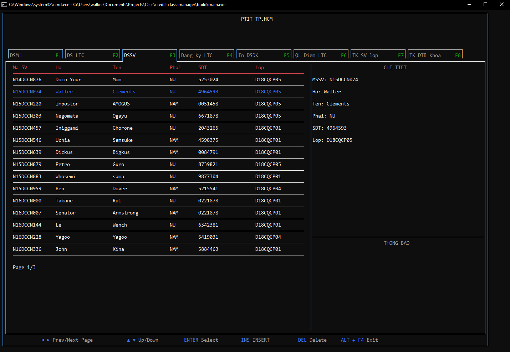
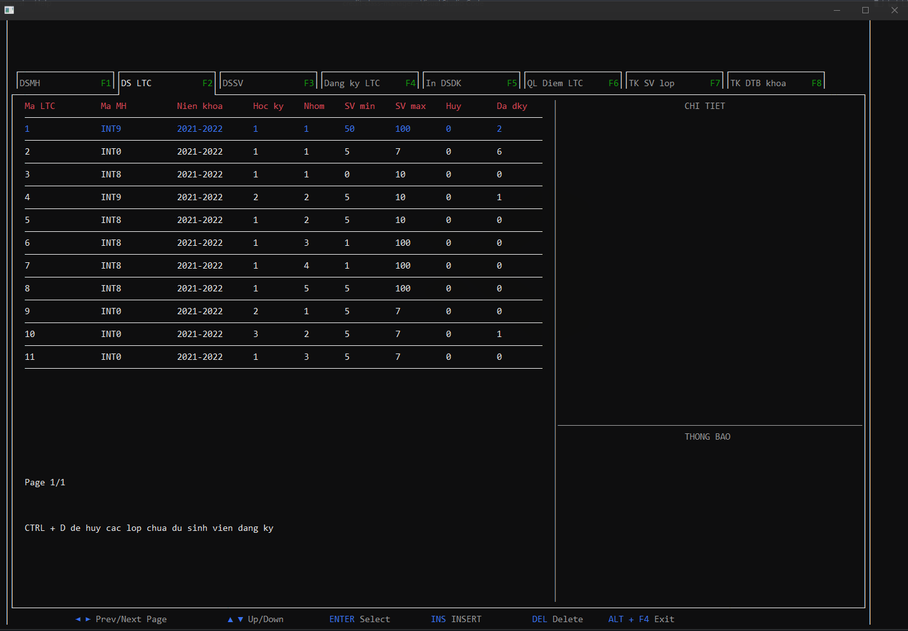
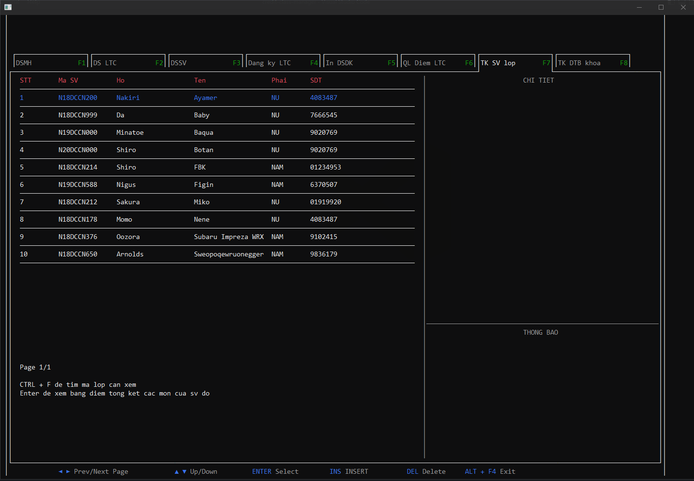

# ĐỒ ÁN CẤU TRÚC DỮ LIỆU & GIẢI THUẬT

## Đề tài quản lý điểm sinh viên theo hệ tín chỉ

<br>

## Download
[Tải demo](https://github.com/WalterClementsJr/credit-class-manager/releases) và đọc hướng dẫn trong README.txt

<br>

## Build
```
cd $project_path/
```
và
```
g++ -Wall $project_path/main/main.cpp -I $project_path/lib -o $project_path/build/main.exe
```

**với `$project_path` là đường dẫn tới folder**

<br>

## Run

```
cd $project_path/
```

và
```
$project_path/build/main.exe
```

### Lưu ý:
Project được viết trên Visual Studio Code và build bằng MinGW. Nếu muốn sử dụng lại những build và run tool (trong .vscode/):
- Đọc [hướng dẫn sử dụng](https://code.visualstudio.com/docs/languages/cpp)
- [Tải MinGW](https://sourceforge.net/projects/mingw-w64/files/mingw-w64/) (nếu chưa có)

<br>

## Demo




