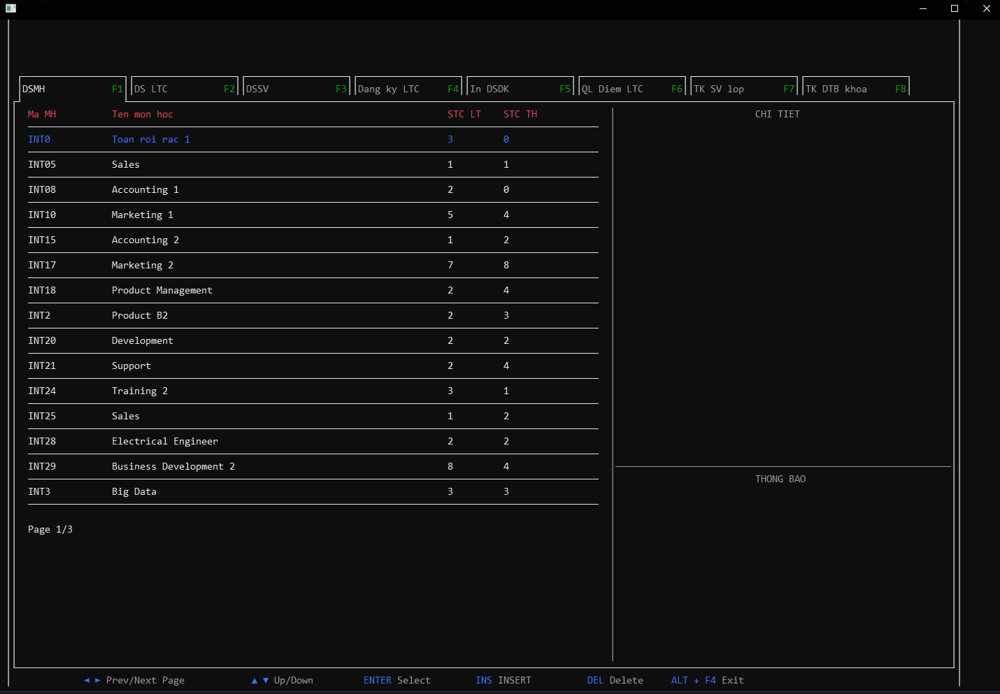
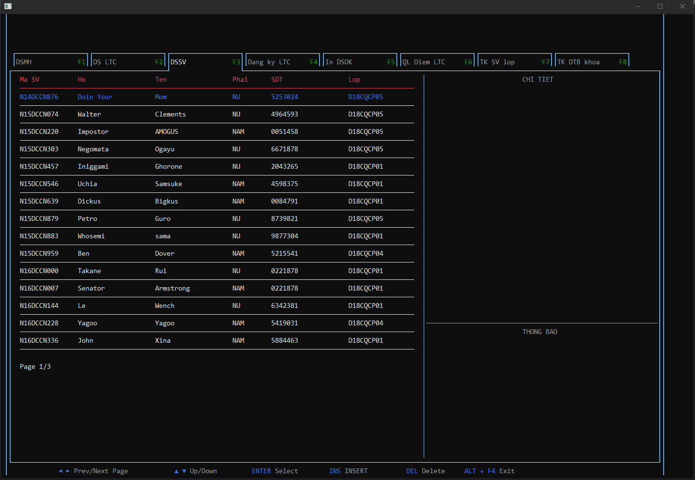

# ĐỒ ÁN CẤU TRÚC DỮ LIỆU & GIẢI THUẬT

## Đề tài quản lý điểm sinh viên theo hệ tín chỉ

## Build

```
g++ -Wall $project_path/main/main.cpp -I $project_path/lib -o $project_path/build/main.exe
```

**với `$project_path` là đường dẫn tới folder**

## Run

```
$project_path/build/main.exe
```

## Demo




